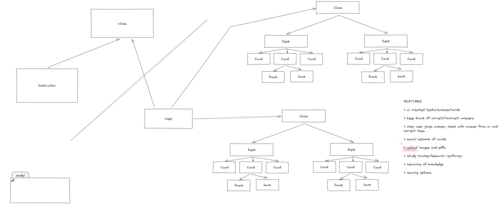
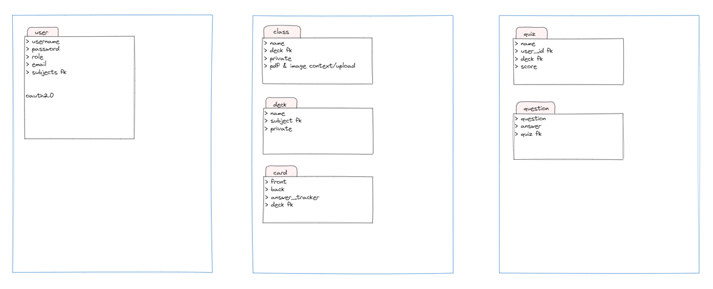

# IntelliCram

IntelliCram revolutionizes the learning experience as the ultimate education companion. Seamlessly integrating cutting-edge technology, IntelliCram empowers users to curate a personalized repository for their classes, effortlessly crafting study materials tailored to their needs.

Harnessing the power of ChatGPT and advanced Artificial Intelligence, IntelliCram goes beyond traditional study aids. It offers an immersive learning environment, providing users with not just information but insightful and in-depth study materials that are finely tuned to enhance understanding and accelerate subject mastery.

Unlock a new era of efficient learning with IntelliCram, where personalized study resources meet the precision of AI-driven insights, ensuring a smarter, faster, and more effective approach to mastering subjects. Your educational journey is about to evolve – experience the intelligence of learning with IntelliCram.

## App Design

> Initial Design 11/12/2023

## Team Members

@johnny-codes

@emadrig

@Taiyam006
